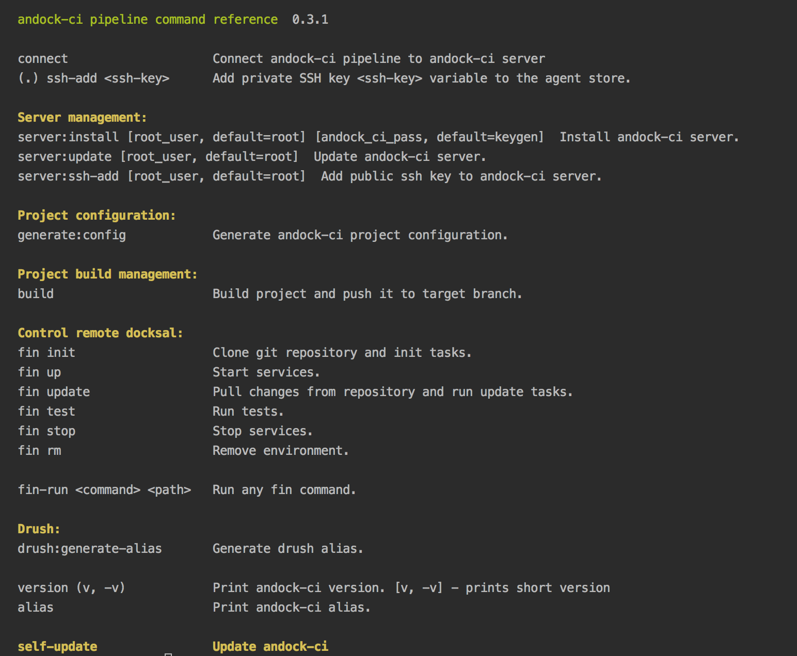

# andock-ci-pipeline (acp) - docksal remote control
## What is andock?
A command line tool managing remote docksal environments with ansible.   
##Key features
* Easy to use command line tool.
* Use ansible to remote control docksal.
* Easy configuration.
* Each branch one environment.
* Extendable with init, update, tests ansible hooks.
* drush support including drush sql-sync without extra ssh container.
* Easy to integrate in your CI environment.

## Commands:

# Getting started?

##Installation scenarios:

* [Use inside docksal](../getting-started-docksal/setup.md)
* Use on ci server: @TODO.
* Standalone: TBD.
